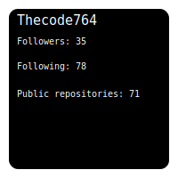

<h1 align="center">Artin karimi</h1>
<h3 align="center">A developer</h3>

- 👋 Hi, I’m Artin karimi


- 👀 I’m interested in Web development

- ♾ I currently working on **Open source projects**

- 🌱 I’m currently learning **Django**, **React** and **Wordpress**

- 📫 How to reach me artin962354@proton.me

- 😄 Pronouns: Male

- 😎 Fun fact: For make a website terminal you can use jquery.terminal

- 📁 I created 71 Repository

- 👤 My follower number is 35

- 👤 I following 77 users
<h3>Language and IDE and Socials</h3>

<h3>Stats</h3>

<h3>Most used languages</h3>

<picture>
  <source media="(prefers-color-scheme: dark)" srcset="https://raw.githubusercontent.com/Thecode764/Thecode764/output/github-contribution-grid-snake-dark.svg">
  <source media="(prefers-color-scheme: light)" srcset="https://raw.githubusercontent.com/Thecode764/Thecode764/output/github-contribution-grid-snake.svg">
  
</picture>
<h3>Others</h3>


<h3>Discord activity</h3>


<h3>Wakatime</h3>
<!--START_SECTION:waka-->


**🐱 My GitHub Data** 

> 📦 55.9 kB Used in GitHub's Storage 
 > 
> 🏆 567 Contributions in the Year 2024
 > 
> 🚫 Not Opted to Hire
 > 
> 📜 58 Public Repositories 
 > 
> 🔑 2 Private Repositories 
 > 
**I'm an Early 🐤** 

```text
🌞 Morning                442 commits         █████████░░░░░░░░░░░░░░░░   35.88 % 
🌆 Daytime                500 commits         ██████████░░░░░░░░░░░░░░░   40.58 % 
🌃 Evening                290 commits         ██████░░░░░░░░░░░░░░░░░░░   23.54 % 
🌙 Night                  0 commits           ░░░░░░░░░░░░░░░░░░░░░░░░░   00.00 % 
```
📅 **I'm Most Productive on Monday** 

```text
Monday                   313 commits         ██████░░░░░░░░░░░░░░░░░░░   25.41 % 
Tuesday                  284 commits         ██████░░░░░░░░░░░░░░░░░░░   23.05 % 
Wednesday                242 commits         █████░░░░░░░░░░░░░░░░░░░░   19.64 % 
Thursday                 80 commits          ██░░░░░░░░░░░░░░░░░░░░░░░   06.49 % 
Friday                   68 commits          █░░░░░░░░░░░░░░░░░░░░░░░░   05.52 % 
Saturday                 120 commits         ██░░░░░░░░░░░░░░░░░░░░░░░   09.74 % 
Sunday                   125 commits         ███░░░░░░░░░░░░░░░░░░░░░░   10.15 % 
```


📊 **This Week I Spent My Time On** 

```text
🕑︎ Time Zone: Asia/Tehran

💬 Programming Languages: 
HTML                     11 hrs 29 mins      ███████████░░░░░░░░░░░░░░   42.71 % 
Markdown                 5 hrs 13 mins       █████░░░░░░░░░░░░░░░░░░░░   19.42 % 
JavaScript               3 hrs 33 mins       ███░░░░░░░░░░░░░░░░░░░░░░   13.22 % 
TOML                     2 hrs 33 mins       ██░░░░░░░░░░░░░░░░░░░░░░░   09.48 % 
CSS                      1 hr 29 mins        █░░░░░░░░░░░░░░░░░░░░░░░░   05.57 % 

🔥 Editors: 
VS Code                  26 hrs 55 mins      █████████████████████████   100.00 % 

🐱‍💻 Projects: 
kita                     21 hrs 20 mins      ████████████████████░░░░░   79.24 % 
Profile-page             1 hr 31 mins        █░░░░░░░░░░░░░░░░░░░░░░░░   05.64 % 
Repo-Fetch               1 hr 10 mins        █░░░░░░░░░░░░░░░░░░░░░░░░   04.39 % 
ntn                      42 mins             █░░░░░░░░░░░░░░░░░░░░░░░░   02.63 % 
bot.space                41 mins             █░░░░░░░░░░░░░░░░░░░░░░░░   02.57 % 

💻 Operating System: 
Linux                    26 hrs 55 mins      █████████████████████████   100.00 % 
```

**I Mostly Code in Python** 

```text
Python                   30 repos            ████████████████░░░░░░░░░   62.50 % 
HTML                     4 repos             ██░░░░░░░░░░░░░░░░░░░░░░░   08.33 % 
JavaScript               3 repos             ██░░░░░░░░░░░░░░░░░░░░░░░   06.25 % 
CSS                      2 repos             █░░░░░░░░░░░░░░░░░░░░░░░░   04.17 % 
Ruby                     2 repos             █░░░░░░░░░░░░░░░░░░░░░░░░   04.17 % 
```


**Timeline**


 Last Updated on 03/06/2024 18:43:16 UTC
<h3>Trophy</h3>


<h3>Linux</h3>


```console
            .-/+oossssoo+/-.               👤 null@null 
        `:+ssssssssssssssssss+:`           --------- 
      -+ssssssssssssssssssyyssss+-         📇 Name: Ubuntu
    .ossssssssssssssssssdMMMNysssso.       🗔 Desktop: Unity
   /ssssssssssshdmmNNmmyNMMMMhssssss/      ✨ Terminal: Gnome Terminal
  +ssssssssshmydMMMMMMMNddddyssssssss+     ⭐ Shell: Bash, zsh, fish
 /sssssssshNMMMyhhyyyyhmNMMMNhssssssss/    🔥  Unity version: Unity 7.7.0 
.ssssssssdMMMNhsssssssssshNMMMdssssssss.                    
+sssshhhyNMMNyssssssssssssyNMMMysssssss+  
ossyNMMMNyMMhsssssssssssssshmmmhssssssso   --------------------------------
ossyNMMMNyMMhsssssssssssssshmmmhssssssso   🚧 Projects: See my profile
+sssshhhyNMMNyssssssssssssyNMMMysssssss+   
.ssssssssdMMMNhsssssssssshNMMMdssssssss.   
 /sssssssshNMMMyhhyyyyhdNMMMNhssssssss/    
  +sssssssssdmydMMMMMMMMddddyssssssss+     
   /ssssssssssshdmNNNNmyNMMMMhssssss/      
    .ossssssssssssssssssdMMMNysssso.       
      -+sssssssssssssssssyyyssss+-
        `:+ssssssssssssssssss+:`           
            .-/+oossssoo+/-.
```

<h3>Activity graph</h3>

<h3>Activity</h3>

<!--START_SECTION:activity-->
1. ❗ Opened issue [#30751](https://github.com/mastodon/mastodon/issues/30751) in [mastodon/mastodon](https://github.com/mastodon/mastodon)
2. 🔒 Closed issue [#42547](https://github.com/electron/electron/issues/42547) in [electron/electron](https://github.com/electron/electron)
3. 🔓 Reopened issue [#42547](https://github.com/electron/electron/issues/42547) in [electron/electron](https://github.com/electron/electron)
4. 🔒 Closed issue [#42547](https://github.com/electron/electron/issues/42547) in [electron/electron](https://github.com/electron/electron)
5. 🗣 Commented on [#42547](https://github.com/electron/electron/issues/42547#issuecomment-2175013534) in [electron/electron](https://github.com/electron/electron)
<!--END_SECTION:activity-->





## Metrics


## Profile views (number 4 😂)

## Code berg acc
@Thecode764

For other projects mirror (empty for now)
## Hmmmm

